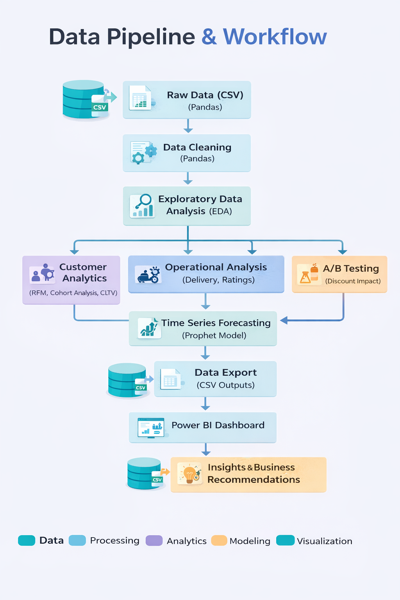
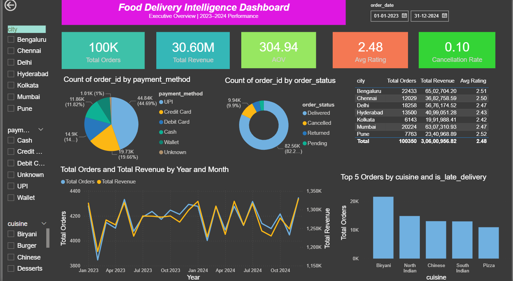

# 🍔 Food Delivery Intelligence System | End-to-End Data Analytics Project

## 🚧 Project Status: Work in Progress

This project is actively being enhanced with:

* SQL integration (data querying & transformation)
* Additional Power BI visualizations
* Dashboard UI improvements

---

## 🚀 Project Overview

This project is an **end-to-end data analytics solution** built on a food delivery dataset.
It covers the complete pipeline from **data cleaning → analysis → modeling → visualization → business insights**.

A full **business report** is also included, covering customer behavior, operations, A/B testing, and demand forecasting.

---

## 🎯 Business Problem

Food delivery platforms often face:

* High churn after first order
* Poor delivery performance affecting ratings
* Unpredictable demand

This project solves these using data-driven insights.

---

## 🛠 Tech Stack

* Python (Pandas, NumPy, Matplotlib, Seaborn)
* Machine Learning (Prophet - Forecasting)
* Power BI (Dashboard)
* SQL (Coming Soon)
* Streamlit (Optional)

---

## 🔄 Data Pipeline & Workflow



### 🧠 Pipeline Explanation

* Raw data → CSV files
* Data cleaning → Pandas
* EDA → trend & pattern analysis
* Feature engineering
* Customer analytics (RFM, CLTV, Cohort)
* Operational analysis (delivery, ratings)
* A/B testing (discount impact)
* Forecasting (Prophet model)
* Power BI dashboard → insights

---

## 📊 Power BI Dashboard

### 🏠 Executive Overview



---

## 🎯 Dashboard Highlights

* KPI Cards → Orders, Revenue, AOV, Rating, Cancellation
* Monthly trends → Orders & Revenue
* City-wise performance
* Payment method distribution
* Order status breakdown
* Top cuisines
* Interactive slicers

---

## 📄 Business Report

A detailed report is included covering:

* Executive Summary
* Business Problem
* Data Cleaning
* Customer Analytics
* Operational Analysis
* A/B Testing
* Forecasting
* Business Recommendations

👉 Download here:
[Download Report](reports/Food_Delivery_Intelligence_Report.docx)

---

## 📈 Key Insights

* 60% revenue from high-value customers
* Delivery delay reduces ratings
* Discounts improve repeat, not conversion
* High first-order churn (~78%)
* Demand peaks on weekends

---

## 📈 Business Recommendations

* Launch loyalty program
* Improve delivery SLA
* Optimize discount strategy
* Use forecasting for planning

---

## 📊 Dashboard Design Approach

* Top → KPI cards
* Middle → breakdown analysis
* Bottom → trends

Includes slicers for:

* City
* Cuisine
* Payment
* Date

---

## 📦 Project Structure

```text
Food-Delivery-Project/
│
├── data/
│   └── clean_data_full.csv
│
├── notebooks/
│   ├── EDA.ipynb
│   ├── Customer_Analytics.ipynb
│   ├── Forecasting.ipynb
│
├── outputs/
│   ├── forecast_30days.csv
│   ├── forecast_by_city.csv
│
├── powerbi/
│   └── dashboard.pbix (external link)
│
├── reports/
│   └── Food_Delivery_Intelligence_Report.docx
│
├── images/
│   ├── data_pipeline.png
│   ├── dashboard_page1.png
│
├── app.py
└── README.md
```

---

## 📥 Download Dashboard

Due to GitHub file size limits:

👉 Add your link:
[Download Power BI File](YOUR_GOOGLE_DRIVE_LINK)

---

## 🔜 Upcoming Improvements

* SQL integration
* More Power BI visuals
* UI improvements

---

## 🌐 Deployment (Optional)

```bash
streamlit run app.py
```

---

## 🧠 Learnings

* End-to-end analytics
* Business problem solving
* Dashboard storytelling
* Forecasting
* Statistical testing

---

## 👤 Author

**Your Name**
Aspiring Data Analyst

---

## ⭐ If you like this project

Give it a ⭐ on GitHub!
